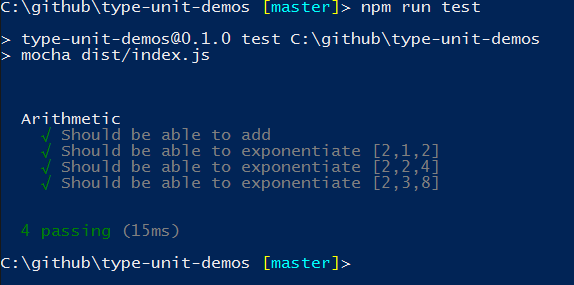

# type-unit-demos

Example of using TypeUnit ( https://github.com/basespace/type-unit ) and the TypeUnit Mocha plugin ( https://github.com/aroberts-illumina/type-unit-mocha ) to write and execute a test suite.

Test suite:

```
/// <reference path="../node_modules/type-unit/type-unit.d.ts" />
/// <reference path="../typings/main/ambient/node/index.d.ts" />

import {fact, suite, theory} from "type-unit";
import * as assert from "assert";

@suite("Arithmetic")
class MathTests {

    @fact("Should be able to add")
    addition() {
        assert.equal(1 + 1, 2);
    }

    @theory([
      [2, 1, 2],
      [2, 2, 4],
      [2, 3, 8]
      ], "Should be able to exponentiate")
    exponentiation(base: number, exponent: number, expectedValue: number) {
       assert.equal(Math.pow(base, exponent), expectedValue);
    }
}
```

Build by running TypeScript compiler `tsc`.

Run compiled tests with mocha by running `npm run test`.

Result:


